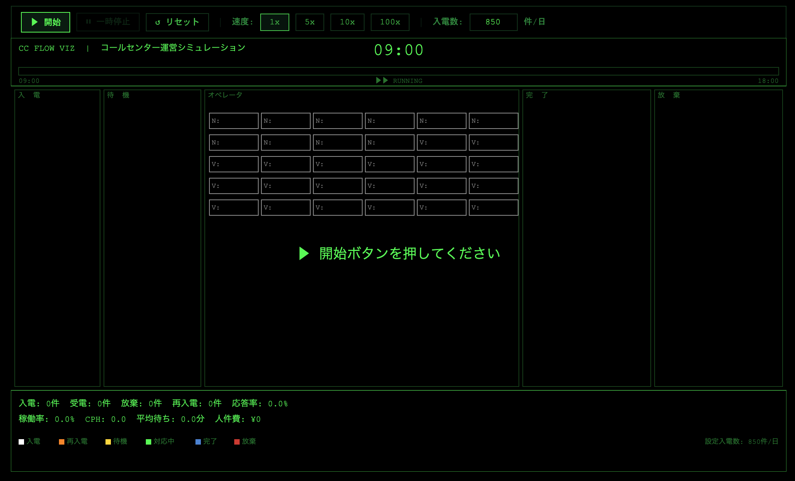

# CC Flow Viz — コールセンター運営シミュレーション

コールセンターの1日（9:00〜18:00）の運営を早回し再生する、レトロゲーム風ビジュアライゼーションです。

入電 → 待機 → 対応 → 完了 / 放棄 → 再入電 の流れをドットアニメーションで表現します。

**ポートフォリオ用途を想定しており、エンジニア・採用担当・コールセンター業務経験者の双方に訴求します。**

---

## デモ

> `index.html` をブラウザで開くだけで動作します（サーバー不要）。

<!-- 公開URL が決まったらここに追記 -->
<!-- 例: https://your-domain.com/cc_flow_viz/ -->

---

## スクリーンショット



---

## 動作フロー


---

## 特徴

| 項目 | 内容 |
|---|---|
| 言語 | HTML / JavaScript |
| ライブラリ | p5.js（CDN 読み込み、インストール不要） |
| ファイル構成 | `index.html` 1ファイル完結 |
| 実行環境 | ブラウザのみ（Node.js / サーバー不要） |

---

## シミュレーション概要

- **受付時間**: 9:00〜18:00（新規入電受付）
- **オペレータ**: 30名（新人 10名 / ベテラン 20名）
- **再生時間**: 約200秒（1x 速度）で 9時間分を早回し再生
- **乱数シード固定**: 毎回同じ展開を再現（seed=42）
- **速度独立**: 再生速度を変えても結果（応答率・件数など）は変化しない

### ドットの色と状態

| 色 | 状態 | 説明 |
|---|---|---|
| 白 | 入電（初回） | 入電ゾーンに 1.5秒フェードアウト表示 |
| オレンジ | 入電（再入電） | 放棄後に再入電した顧客 |
| 黄 | 待機中 | オペレータの空き待ち |
| 緑 | 対応中 | オペレータが対応中 |
| 灰 | 完了 | 対応完了・完了ボックスに蓄積 |
| 赤 | 放棄 | 待ちすぎて離脱・放棄ボックスに蓄積 |

---

## 操作方法

| ボタン | 動作 |
|---|---|
| ▶ 開始 | 入電数の設定を反映して新規シミュレーション開始 |
| ⏸ 一時停止 / ▶ 再開 | シミュレーションの一時停止・再開 |
| ↺ リセット | シミュレーションをリセット（未開始状態に戻る） |
| 速度ボタン（1x / 5x / 10x / 100x） | 再生速度の切り替え |
| 入電数入力（50〜2000） | 1日の入電数を変更（開始・リセット時に反映） |

---

## ファイル構成

```
cc_flow_viz/
├── index.html        # 実装本体（p5.js + シミュレーション + 描画）
├── screenshot.png    # スクリーンショット
├── flow_diagram.png  # 動作フロー図
├── README.md         # このファイル
├── SPEC.md           # 仕様書
└── VARIABLES.md      # 変数・定数定義書
```

---

## カスタマイズ

`index.html` 内の定数を変更することで挙動を調整できます。

```javascript
const DEFAULT_CALLS = 850;  // デフォルト入電数

const CONFIG = {
  MAX_QUEUE_LENGTH:   30,    // 待機できる最大顧客数
  MAX_WAIT_MINUTES:    5,    // 放棄までの待ち時間（分）
  RETRY_RATE:        0.30,   // 再入電確率
  RETRY_DELAY_MIN:     5,    // 再入電までの最短待ち（分）
  RETRY_DELAY_MAX:    15,    // 再入電までの最長待ち（分）
  RANDOM_SEED:        42,    // 乱数シード
};
```

---

## ライセンス

MIT
